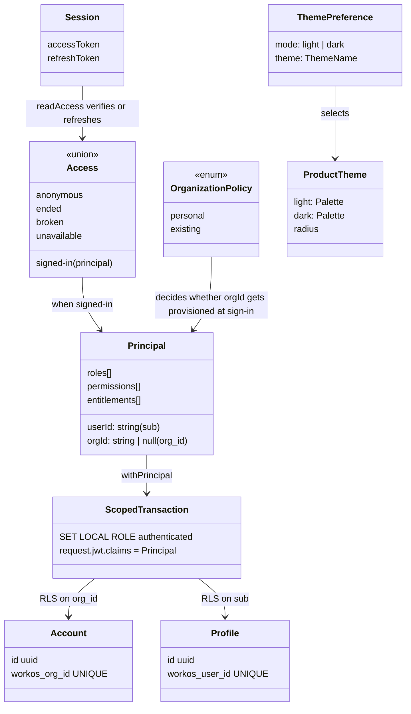

# Domain model

This page defines the terms of the application domain: identity, tenancy, data and presentation in
the reference application and the packages it is built from, and how they relate. Implementation
detail is in the [system overview](system-overview.md).

## Application domain

### Identity and tenancy

| Term                      | Meaning                                                                                                                                                                                                                             | Code                                                                         |
| ------------------------- | ----------------------------------------------------------------------------------------------------------------------------------------------------------------------------------------------------------------------------------- | ---------------------------------------------------------------------------- |
| **Identity provider**     | WorkOS AuthKit. It owns users, organizations, memberships, roles, permissions and entitlements. The application does not copy any of them.                                                                                          | `packages/auth-workos`, `docs/user-entity.md`                                |
| **Principal**             | The only caller identity downstream code sees. It is built from verified claims. `roles` falls back to the singular `role` claim. A wrong-shaped claim throws `claims`.                                                             | `packages/auth/src/principal.ts`                                             |
| **Verifier**              | A function from access token to `Principal`, bound to one issuer and a JWKS source. It requires `exp` and `sub`, sets no audience because WorkOS omits `aud`, and allows 5 s of clock skew.                                         | `packages/auth/src/verify.ts`, `packages/auth-session/src/services.ts`       |
| **AuthFailure**           | The vendor-neutral reason a token failed: `malformed`, `signature`, `expired`, `issuer`, `audience`, `claims` or `unavailable`.                                                                                                     | `packages/auth/src/errors.ts`                                                |
| **WorkOSAuthFailure**     | Sixteen provider reasons, from `mfa-challenge-required` to `provider`. They collapse to three callback dispositions: `retry`, `unsupported` and `misconfigured`.                                                                    | `packages/auth-workos/src/errors.ts`, `packages/auth-session/src/failure.ts` |
| **Session**               | An access token and a refresh token sealed with AES-256-GCM into one httpOnly cookie that lasts a year. It never holds claims.                                                                                                      | `packages/auth-session/src/session.ts`                                       |
| **Access**                | The five states a session cookie can be in. `ended` means sign in again. `broken` means the fault is ours, so no sign-in button is shown. `unavailable` means retry later.                                                          | `packages/auth-session/src/access.ts`                                        |
| **Organization** (tenant) | A WorkOS organization. Under the `personal` policy, a first sign-in without `org_id` creates one with external id `signup:<userId>` and no domains, adds a membership, and refreshes the token. `existing` leaves membership alone. | `packages/auth-session/src/callback.ts` `ensureOrganization`                 |
| **Auth runtime**          | The application's bound set of handlers (`startSignIn`, `completeSignIn`, `sendEmailCode`, `verifyEmailCode`, `endSession`, `access`). Configuration loads from the environment on first use.                                       | `packages/auth-tanstack/src/runtime.ts`                                      |
| **Cookie namespace**      | 16 hex characters of `sha256(clientId:redirectUri)`, prefixed to every auth cookie so that two apps on one host do not collide.                                                                                                     | `packages/auth-session/src/config.ts`                                        |

### Persistence

| Term                             | Meaning                                                                                                                                                               | Code                                                 |
| -------------------------------- | --------------------------------------------------------------------------------------------------------------------------------------------------------------------- | ---------------------------------------------------- |
| **Account**                      | The tenant row, one per WorkOS organization, inserted just in time. Product tables are meant to reference it.                                                         | `db/schema.sql`                                      |
| **Profile**                      | Per-user application state, one per WorkOS user. It deliberately has no foreign key to an account, because a user can belong to several.                              | `db/schema.sql`                                      |
| **`authenticated` role**         | The Postgres role every scoped transaction switches to. It is named to match Supabase's role.                                                                         | `packages/db/migrations/20260822081700_identity.sql` |
| **Claims GUC**                   | `request.jwt.claims`, set transaction-locally from the `Principal`, never from the raw token. It is read by `app.current_user_id()` and `app.current_org_id()`.       | `packages/db/src/scoped.ts`, identity migration      |
| **Scoped transaction**           | The only way to query as a user: one client, `BEGIN`, set role, set claims, body, `COMMIT`. Role and claims vanish at commit.                                         | `runScoped`, `Database.withPrincipal`                |
| **Desired state vs. migrations** | `db/schema.sql` feeds `atlas migrate diff`. Policies, functions, roles and grants exist only in hand-written migrations, because Atlas Community drops them silently. | `docs/decisions.md`, `moon.yml` Atlas tasks          |

### Presentation

| Term                 | Meaning                                                                                                                                                                       | Code                                                               |
| -------------------- | ----------------------------------------------------------------------------------------------------------------------------------------------------------------------------- | ------------------------------------------------------------------ |
| **Color token**      | One of 31 shadcn variable names every theme must fill.                                                                                                                        | `packages/theme/src/contract.ts`                                   |
| **Product theme**    | A light palette, a dark palette and a radius. `editor` (the default) and `canvas` ship.                                                                                       | `packages/theme/src/themes/`                                       |
| **Theme preference** | Mode plus theme name, stored as `mode:theme` in a cookie named per origin. Each half is validated separately and falls back to the default.                                   | `packages/theme/src/preference.ts`, `apps/web/src/server/theme.ts` |
| **Primitive**        | A small reusable component in `packages/ui/src/components/`, such as `Button`, `Card`, `Stack` or `Heading`.                                                                  | `packages/ui`                                                      |
| **View**             | A composed reusable screen that receives application labels and paths as props, such as `SignInPanel`, `VerifyCodePanel`, `SessionErrorPanel`, `ThemeLab` or `ThemeSwitcher`. | `packages/views/src/<view>/`                                       |
| **Feature**          | Application-owned model, UI and server behavior under `apps/web/src/features/<name>/`. `workspace` is the example.                                                            | `docs/code-layout.md`                                              |
| **Composition root** | `apps/web/src/server/`, where the application picks its provider, paths, organization policy, database and theme adapter.                                                     | `apps/web/src/server/*.ts`                                         |
| **Route group**      | A `(name)/` directory that organizes routes without a URL segment and without implying authentication or a layout.                                                            | `apps/web/src/routes/(auth)/`                                      |

## Boundaries with consuming projects

A project depends on the published packages and owns the application glue it takes from the
reference app. Package code does not know which project it runs in. The package scope is the
coupling point: it is baked into package names, the `@littleorgans/source` export condition and
repository metadata.
