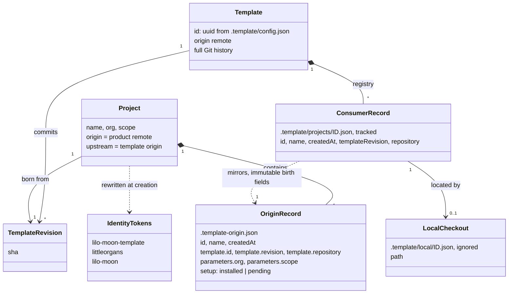
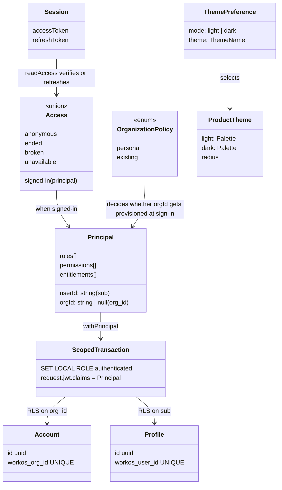

# Domain model

This repository has two domains. The **lineage domain** covers how the template produces and
tracks product repositories. The **application domain** covers identity, tenancy, data and
presentation in the reference application. This page defines the terms each domain uses and how
they relate. Implementation detail is in the [system overview](system-overview.md).

## Lineage domain

| Term                               | Meaning                                                                                                                                                                                                                  | Code                                                                         |
| ---------------------------------- | ------------------------------------------------------------------------------------------------------------------------------------------------------------------------------------------------------------------------ | ---------------------------------------------------------------------------- |
| **Template**                       | This repository, identified by a stable UUID rather than by its name or URL. A checkout is the template exactly when `.template-origin.json` is absent.                                                                  | `.template/config.json`, `scripts/lib/project-registry.mjs` `templateConfig` |
| **Template revision**              | The commit a project is born from (`--ref`, default `HEAD`). It must carry the same template id.                                                                                                                         | `scripts/lib/create-project.mjs` lines 49–59                                 |
| **Project** (consumer, downstream) | An independent Git repository that shares the template's history up to its birth revision, plus one initialization commit. It owns its application code and may delete the examples.                                     | `createProject`                                                              |
| **Initialization commit**          | `chore: initialize <name> from template <sha>`. Contains the identity rewrite, dependency install, `moon sync`, formatting and the origin record. On every template update it is replayed like any other product commit. | `create-project.mjs` lines 95–123                                            |
| **Identity tokens**                | Three strings that name the template. Creation replaces them in every tracked file with the project's slug, org and scope.                                                                                               | `scripts/rename-template.sh` lines 6–11                                      |
| **Scope**                          | The npm scope that replaces `@lilo-moon`. It also renames the `@<scope>/source` export condition. It defaults to the project name.                                                                                       | `scripts/projects.mjs`, `rename-template.sh`                                 |
| **Origin record**                  | The product's birth certificate. Its presence makes creation refuse to run and makes `consumer-check` skip.                                                                                                              | `.template-origin.json`, `project-registry.mjs` `readOrigin`                 |
| **Consumer record**                | A portable, tracked entry in the template listing a project. Its birth fields (`name`, `createdAt`, `templateRevision`) are immutable. `repository` is refreshed on registration.                                        | `registerProject`, `projectRecords`                                          |
| **Local checkout**                 | A machine-specific path to a project, stored outside version control.                                                                                                                                                    | `.template/local/`, ignored in `.gitignore`                                  |
| **Remotes**                        | `origin` is the product repository and the default push target. `upstream` is the template's origin URL.                                                                                                                 | `create-project.mjs` lines 90–94                                             |
| **Template update**                | `git fetch upstream` then `git rebase upstream/main` in the project. No tool automates or checks it.                                                                                                                     | `docs/project-lineage.md`                                                    |
| **Consumer check**                 | A template-only gate. It creates a real project in a temporary directory, builds and serves it, repeats with packed libraries, and proves that the gates reject violations.                                              | `scripts/consumer-check.mjs`                                                 |

Rules the code enforces:

- Creation runs only from a full, non-shallow template checkout that has an `origin` remote, and
  never into a destination inside it (`planProject`).
- A project's origin differs from the template's origin (`create-project.mjs` line 43).
- Registration runs from the template, for a Git repository root whose origin record carries the
  same template id (`registerProject`).
- A registered birth revision never changes. Git history records later updates.

## Application domain

### Identity and tenancy

| Term                      | Meaning                                                                                                                                                                                                                             | Code                                                                         |
| ------------------------- | ----------------------------------------------------------------------------------------------------------------------------------------------------------------------------------------------------------------------------------- | ---------------------------------------------------------------------------- |
| **Identity provider**     | WorkOS AuthKit. It owns users, organizations, memberships, roles, permissions and entitlements. The application does not copy any of them.                                                                                          | `packages/auth-workos`, `docs/user-entity.md`                                |
| **Principal**             | The only caller identity downstream code sees. It is built from verified claims. `roles` falls back to the singular `role` claim. A wrong-shaped claim throws `claims`.                                                             | `packages/auth/src/principal.ts`                                             |
| **Verifier**              | A function from access token to `Principal`, bound to one issuer and a JWKS source. It requires `exp` and `sub`, sets no audience because WorkOS omits `aud`, and allows 5 s of clock skew.                                         | `packages/auth/src/verify.ts`, `packages/auth-session/src/services.ts`       |
| **AuthFailure**           | The vendor-neutral reason a token failed: `malformed`, `signature`, `expired`, `issuer`, `audience`, `claims` or `unavailable`.                                                                                                     | `packages/auth/src/errors.ts`                                                |
| **WorkOSAuthFailure**     | Sixteen provider reasons, from `mfa-challenge-required` to `provider`. They collapse to three callback dispositions: `retry`, `unsupported` and `misconfigured`.                                                                    | `packages/auth-workos/src/errors.ts`, `packages/auth-session/src/failure.ts` |
| **Session**               | An access token and a refresh token sealed with AES-256-GCM into one httpOnly cookie that lasts a year. It never holds claims.                                                                                                      | `packages/auth-session/src/session.ts`                                       |
| **Access**                | The five states a session cookie can be in. `ended` means sign in again. `broken` means the fault is ours, so no sign-in button is shown. `unavailable` means retry later.                                                          | `packages/auth-session/src/access.ts`                                        |
| **Organization** (tenant) | A WorkOS organization. Under the `personal` policy, a first sign-in without `org_id` creates one with external id `signup:<userId>` and no domains, adds a membership, and refreshes the token. `existing` leaves membership alone. | `packages/auth-session/src/callback.ts` `ensureOrganization`                 |
| **Auth runtime**          | The application's bound set of handlers (`startSignIn`, `completeSignIn`, `sendEmailCode`, `verifyEmailCode`, `endSession`, `access`). Configuration loads from the environment on first use.                                       | `packages/auth-tanstack/src/runtime.ts`                                      |
| **Cookie namespace**      | 16 hex characters of `sha256(clientId:redirectUri)`, prefixed to every auth cookie so that two apps on one host do not collide.                                                                                                     | `packages/auth-session/src/config.ts`                                        |

### Persistence

| Term                             | Meaning                                                                                                                                                               | Code                                            |
| -------------------------------- | --------------------------------------------------------------------------------------------------------------------------------------------------------------------- | ----------------------------------------------- |
| **Account**                      | The tenant row, one per WorkOS organization, inserted just in time. Product tables are meant to reference it.                                                         | `db/schema.sql`                                 |
| **Profile**                      | Per-user application state, one per WorkOS user. It deliberately has no foreign key to an account, because a user can belong to several.                              | `db/schema.sql`                                 |
| **`authenticated` role**         | The Postgres role every scoped transaction switches to. It is named to match Supabase's role.                                                                         | `db/migrations/20260822081700_identity.sql`     |
| **Claims GUC**                   | `request.jwt.claims`, set transaction-locally from the `Principal`, never from the raw token. It is read by `app.current_user_id()` and `app.current_org_id()`.       | `packages/db/src/scoped.ts`, identity migration |
| **Scoped transaction**           | The only way to query as a user: one client, `BEGIN`, set role, set claims, body, `COMMIT`. Role and claims vanish at commit.                                         | `runScoped`, `Database.withPrincipal`           |
| **Desired state vs. migrations** | `db/schema.sql` feeds `atlas migrate diff`. Policies, functions, roles and grants exist only in hand-written migrations, because Atlas Community drops them silently. | `docs/decisions.md`, `moon.yml` Atlas tasks     |

### Presentation

| Term                 | Meaning                                                                                                                                                                       | Code                                                               |
| -------------------- | ----------------------------------------------------------------------------------------------------------------------------------------------------------------------------- | ------------------------------------------------------------------ |
| **Color token**      | One of 31 shadcn variable names every theme must fill.                                                                                                                        | `packages/theme/src/contract.ts`                                   |
| **Product theme**    | A light palette, a dark palette and a radius. `editor` (the default) and `canvas` ship.                                                                                       | `packages/theme/src/themes/`                                       |
| **Theme preference** | Mode plus theme name, stored as `mode:theme` in a cookie named per origin. Each half is validated separately and falls back to the default.                                   | `packages/theme/src/preference.ts`, `apps/web/src/server/theme.ts` |
| **Primitive**        | A small reusable component in `packages/ui/src/components/`, such as `Button`, `Card`, `Stack` or `Heading`.                                                                  | `packages/ui`                                                      |
| **View**             | A composed reusable screen that receives application labels and paths as props, such as `SignInPanel`, `VerifyCodePanel`, `SessionErrorPanel`, `ThemeLab` or `ThemeSwitcher`. | `packages/views/src/<view>/`                                       |
| **Feature**          | Application-owned model, UI and server behavior under `apps/web/src/features/<name>/`. `workspace` and `tasks` are the examples.                                              | `docs/code-layout.md`                                              |
| **Composition root** | `apps/web/src/server/`, where the application picks its provider, paths, organization policy, database and theme adapter.                                                     | `apps/web/src/server/*.ts`                                         |
| **Route group**      | A `(name)/` directory that organizes routes without a URL segment and without implying authentication or a layout.                                                            | `apps/web/src/routes/(auth)/`                                      |

## Boundaries between the two domains

A project inherits the whole application domain as ordinary source. After creation, the template
has no runtime or build-time link to the project. The only connections are shared Git history,
the `upstream` remote and the consumer record. Package code does not know which checkout it runs in.
The identity tokens are the exception: they are baked into package names, the source export
condition, the session key derivation salt (`packages/auth-session/src/config.ts` line 69) and
repository metadata. They are the main coupling point between a template update and a project.
