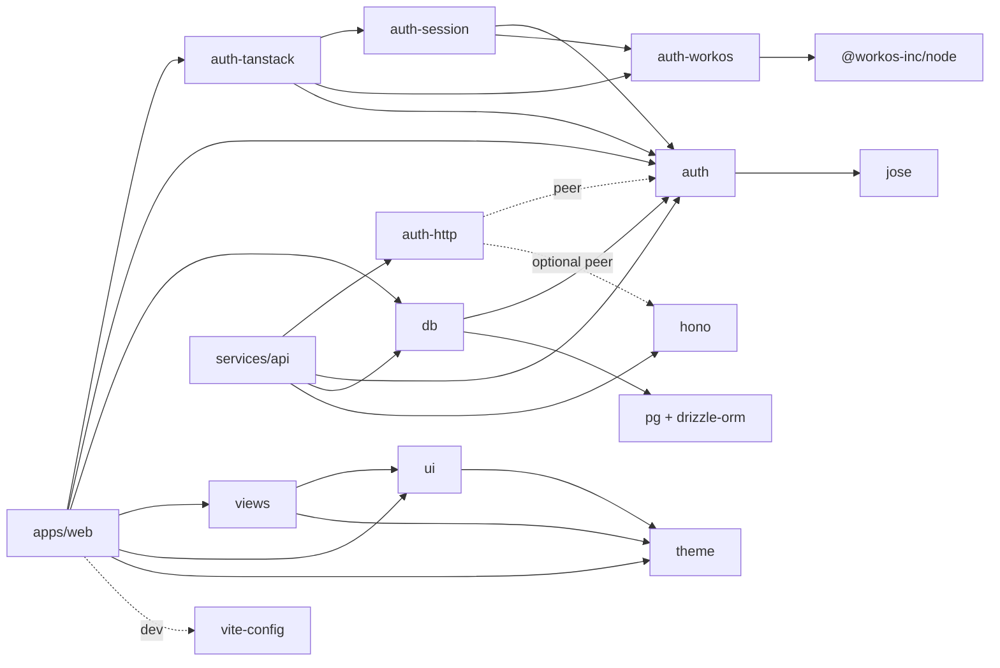
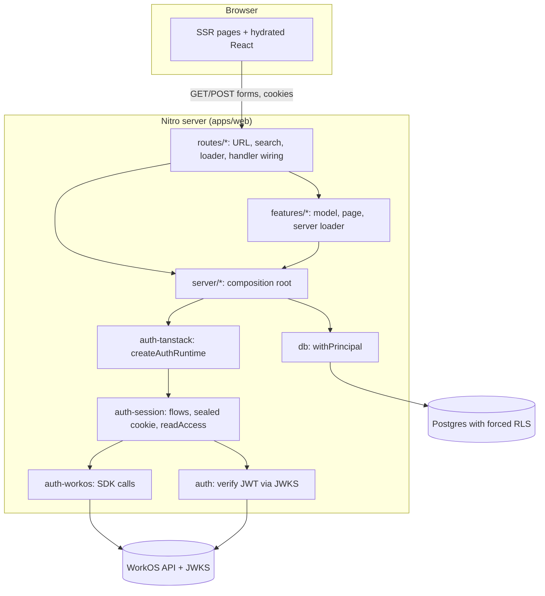
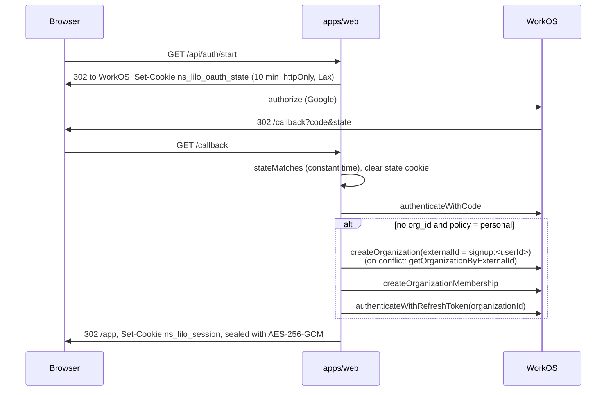
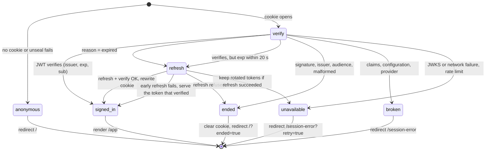
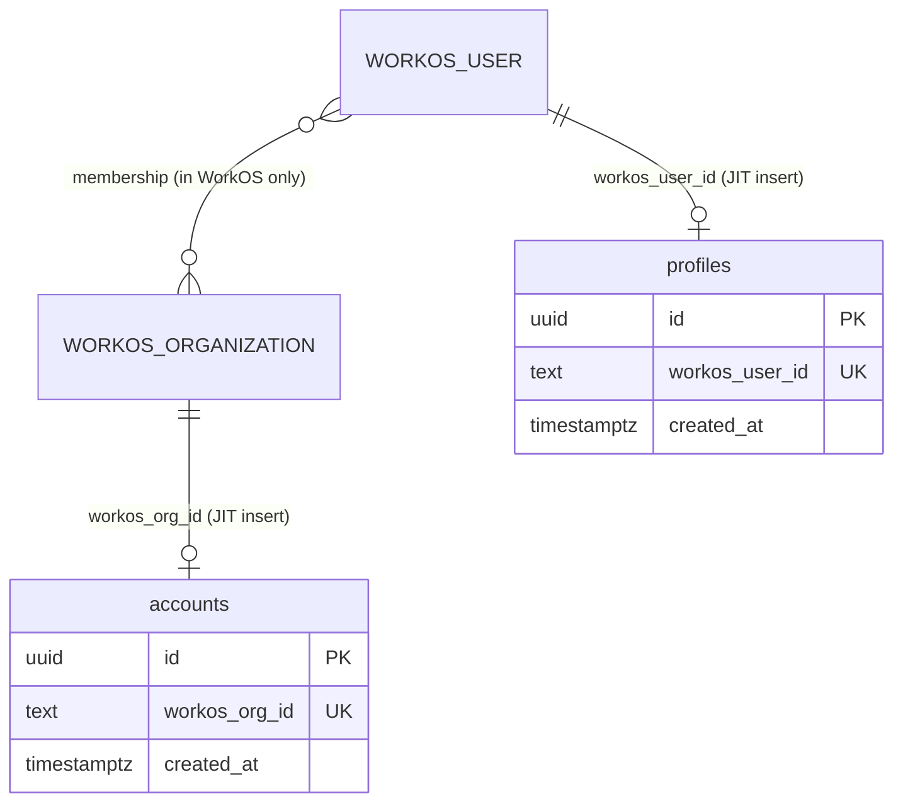
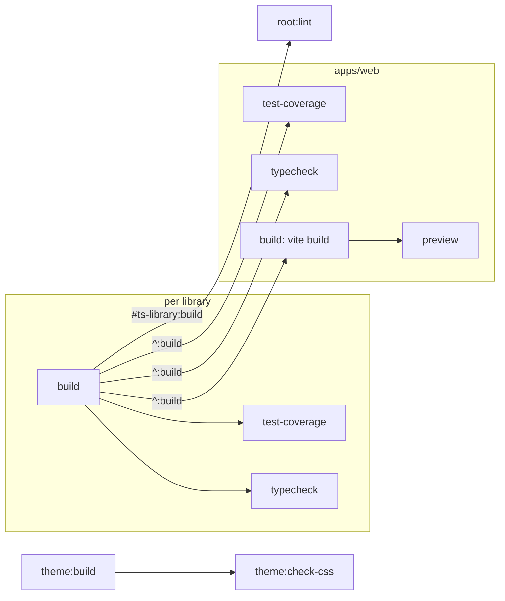

# System overview

This page maps the repository as it stands and describes the runtime, build, test and CI design. Each claim names the file that
implements it. Rationale lives in [the decision record](decisions.md), working rules in
[AGENTS.md](../AGENTS.md), terms in [the domain model](domain-model.md), and a critical review in
[the assessment](assessment.md).

## What problem the repository solves

A new product needs a monorepo that has a task graph, pinned toolchains, lint and format gates, an
identity provider, a tenant-scoped database, a component library and CI before it can do anything
useful. This repository supplies that baseline as a working reference application and as the
`@littleorgans/*` packages it is built from. A product adds the packages as dependencies and
receives fixes through upgrades, not by copying or rebasing this repository. [The
direction](direction.md) describes the packages, publishing and services work in progress.

The baseline makes these choices, recorded in `docs/decisions.md`:

| Concern         | Choice                                                      | Where                                                              |
| --------------- | ----------------------------------------------------------- | ------------------------------------------------------------------ |
| Task graph      | Moon 2.5.5 for every language                               | `.moon/workspace.yml`, `.moon/tasks/*.yml`, `moon.yml`             |
| JS packages     | pnpm 11 with catalogs and supply-chain policy               | `pnpm-workspace.yaml`                                              |
| Languages       | TypeScript 7 (`tsgo`)                                       | `pnpm-workspace.yaml` catalog                                      |
| Lint and format | oxlint (type aware) and oxfmt                               | `packages/oxlint-config`, `.oxfmtrc.json`, `moon.yml` `tasks.lint` |
| Web framework   | TanStack Start on Vite 8 and Nitro                          | `apps/web/vite.config.ts`                                          |
| Identity        | WorkOS AuthKit: Google OAuth and email codes                | `packages/auth-workos`, `packages/auth-session`                    |
| Persistence     | Postgres, Atlas SQL migrations, Drizzle client, forced RLS  | `db/`, `packages/db`, `packages/db-tools`                          |
| UI              | React 19, Tailwind 4, shadcn/Radix components, typed themes | `packages/ui`, `packages/views`, `packages/theme`                  |
| Delivery        | GitHub Actions running `moon ci`, Changesets, Renovate      | `.github/workflows/`, `.changeset/`, `renovate/base.json`          |

## Repository map

```text
.
├── apps/web/               Reference TanStack Start application (the only app)
├── services/api/           Reference HTTP service: Hono, auth-http, db under RLS, container build
├── packages/
│   ├── auth/               Token verification and the Principal: jose only, no vendor SDK
│   ├── auth-workos/        WorkOS SDK wrapper, error translation, organization provisioning
│   ├── auth-session/       Framework-free HTTP sign-in flows, sealed session cookie, access states
│   ├── auth-tanstack/      TanStack Start adapter: cookie jar, lazy runtime, POST-only handlers
│   ├── auth-http/          Service bearer auth on Request/Response, Hono adapter, service config
│   ├── db/                 Pooled Postgres, the principal-scoped transaction, the shipped migrations
│   ├── db-tools/           rls-verify, and db-tools: Atlas, typed Drizzle schema, Postgres container
│   ├── theme/              Token contract, two themes, validation, generated CSS, preference cookie
│   ├── ui/                 shadcn primitives plus layout and typography components
│   ├── views/              Composed reusable screens: sign-in, code entry, session error, theme lab
│   ├── vite-config/        Source-condition and client-boundary settings for Vite, Vitest defaults
│   ├── tsconfig/           The shared compiler options that tsconfig.options.json extends
│   ├── oxlint-config/      The shared lint rules that .oxlintrc.json extends, with the layout rule
│   └── create-app/         pnpm create @littleorgans/app: a new project, generated from the reference
├── db/
│   ├── schema.sql          Atlas desired state: accounts and profiles
│   └── drizzle/            @littleorgans/drizzle-schema: the typed schema in _generated/, which the app and service query through
├── scripts/                RLS assertions, security, consumer, release and gate scripts
├── .moon/                  Workspace, toolchains, and inherited task layers
├── .changeset/             Pending changesets
├── .github/workflows/      moon-ci.yml (reusable: moon ci), its caller ci.yml, and release.yml
├── renovate/base.json      Renovate preset projects extend; renovate.json extends it here too
└── docs/                   Decisions, guides, specifications and this overview
```

Moon discovers members through `projects.globs` in `.moon/workspace.yml`. pnpm discovers the same
directories through `packages` in `pnpm-workspace.yaml`. The repository root is itself a Moon
project that owns workspace-wide tasks in `moon.yml`.

### Package dependencies

Edges come from each member's `package.json` and nowhere else. Moon infers its project graph from
the `workspace:` dependencies there, and `moon sync` mirrors them into TypeScript project references
in each `tsconfig.json`. No JavaScript member's `moon.yml` declares `dependsOn`; `scripts/tests/integration/project-graph.test.mjs`
fails if one does or if Moon's edges stop matching the manifests. Members without a `package.json`
keep their own dependency model, including explicit Moon edges. Shared compiler and test settings
are task inputs through `.moon/tasks/node.yml`, including the config packages' export manifests;
changing either the settings or their resolution invalidates the consuming tasks.



### Key seams

Each seam is a narrow structural interface. Tests use it to exercise the security logic without a
live framework, provider or database.

| Seam                             | Declared in                                                    | Implemented by                                    | Purpose                                                             |
| -------------------------------- | -------------------------------------------------------------- | ------------------------------------------------- | ------------------------------------------------------------------- |
| `Verifier` / `Principal`         | `packages/auth/src/verify.ts`, `principal.ts`                  | `createVerifier` (jose + JWKS)                    | Vendor-neutral identity: `userId`, `orgId`, roles, and more         |
| `WorkOSClient`                   | `packages/auth-workos/src/client.ts`                           | `@workos-inc/node` `WorkOS`                       | The exact SDK slice used; tests inject a recording client           |
| `CookieJar`                      | `packages/auth-session/src/cookies.ts`                         | `packages/auth-tanstack/src/cookies.ts`           | Keeps session logic free of any web framework                       |
| `Access` union                   | `packages/auth-session/src/access.ts`                          | `readAccess`                                      | Five session states the app branches on, never an exception         |
| `UserAccess` / `UserFetch`       | `packages/auth-session/src/delegate.ts`                        | `readUserAccess`, `AuthRuntime.asUser`            | Calls a service as the person without exposing their token          |
| `ScopedClient` / `ScopedRunner`  | `packages/db/src/scoped.ts`, `apps/web/src/server/database.ts` | `pg` client, `Database.withPrincipal`             | The only way claims enter Postgres                                  |
| `ThemeTarget`                    | `packages/theme/src/apply.ts`                                  | `element.style`                                   | Applies data themes without DOM types                               |
| `@littleorgans/source` condition | every library `package.json` `exports`                         | `packages/vite-config/src/index.ts`               | Dev resolves `src`, builds and Node resolve `dist`                  |
| Composition root                 | `apps/web/src/server/*.ts`                                     | `createAuthRuntime`, `getDatabase`, theme adapter | Application policy (paths, provider, org policy, copy) in one place |
| Service composition root         | `services/api/src/server/*.ts`                                 | `createApp`, `startService`                       | Auth, database, logging and shutdown for the reference service      |

### Application layout

`docs/code-layout.md` is the authoritative layout guide. In summary:

- `apps/web/src/routes/` holds URL wiring only. `(auth)/` groups `/callback`, `/session-error` and
  `/verify-email` without adding a segment. `api/` directories add path segments.
- `apps/web/src/features/<name>/` owns a feature's model, UI and server behavior. `workspace/` is the
  complete example. `auth/search.ts` holds a search validator.
- `apps/web/src/server/` is the composition root. `auth.ts` selects `GoogleOAuth`, `/app`,
  `personal` and `/verify-email`. `database.ts` builds the database lazily from `DATABASE_URL`.
  `theme.ts` adapts the theme cookie. `product.ts` holds the product-facing copy (the document
  title and the sign-in and session-error text) and `SHOW_THEME_LAB`, true only on the dev server.
  It is public data imported into both bundles; keep credentials and service imports out.
  `startup.ts` is a Nitro plugin that runs `loadAuthConfig` before the standalone Node server
  listens, so a bad cookie password fails the deploy rather than the first request. The dev server
  skips it only when every auth value is absent or empty. Other presets need their own
  startup or readiness probe.
- `apps/web/src/routeTree.gen.ts` is generated by the TanStack Start Vite plugin during a build.

## How projects use this repository

Projects do not copy this repository. `pnpm create @littleorgans/app` (`packages/create-app`)
writes a new project that installs the published packages and owns the application glue it was
given: the workspace root, a web app, a service, or both, and optionally the database. Nothing
updates that glue afterwards; fixes reach projects through package upgrades.

The command's template is generated, never written by hand. Its build
(`packages/create-app/src/generate/`) reads `apps/web`, `services/api`, `db/`, the root
configuration and `@littleorgans/db`'s migrations from the same commit and rewrites what ties them
to this repository: `workspace:` dependencies become catalog pins at the release, names, ports and
the organization policy become tokens, and the CI caller names `moon-ci.yml` at `v<version>`. Every
root entry, root task and `.env.example` paragraph is classified there (a new variable or merged
paragraph needs an explicit rule), and a reference change the
generator does not recognize, or an anchor it rewrites that moved, fails the build. The build
also rejects deleted rewrite targets, symbolic links, binary assets without encoding support and
tracked environment values. The generated cookie password is empty and must be filled with a
fresh random value in the ignored `.env.local`; no usable shared secret is shipped. The build
formats the result as the project's own `format-check` will. `root:published-shape` then runs the
packed command into scratch projects and requires each to pass its own `moon ci --force`, so the
template cannot drift from the reference. The template machinery that created, renamed and rebased
product repositories was removed in phase 1.

## Runtime architecture

`apps/web` is a TanStack Start application. Vite builds it with `tailwindcss()`, `tanstackStart()`,
`react()` and `nitro()` (`apps/web/vite.config.ts`), and Nitro serves it from
`.output/server/index.mjs`. All authentication runs on the server. The browser only follows
redirects and submits forms.



### Routes

| URL                      | File                              | Behavior                                                                  |
| ------------------------ | --------------------------------- | ------------------------------------------------------------------------- |
| `/`                      | `routes/index.tsx`                | `SignInPanel`; `?ended=true` shows the session-ended notice               |
| `/app`                   | `routes/app.tsx`                  | Server function `loadWorkspaceOrRedirect`, renders `WorkspacePage`        |
| `/theme`                 | `routes/theme.tsx`                | `ThemeLab` using the root loader's preference; 404 outside the dev server |
| `/callback`              | `routes/(auth)/callback.ts`       | `GET` → `auth.completeSignIn`                                             |
| `/verify-email`          | `routes/(auth)/verify-email.tsx`  | `VerifyCodePanel`; `?retry=true` after a refused code                     |
| `/session-error`         | `routes/(auth)/session-error.tsx` | `SessionErrorPanel`; retry link only for `unavailable`                    |
| `/api/auth/start`        | `routes/api/auth/start.ts`        | `GET` → mint state cookie, 302 to WorkOS                                  |
| `/api/auth/email/start`  | `routes/api/auth/email/start.ts`  | `POST` → throttle, send code, set email cookie, 302 to `/verify-email`    |
| `/api/auth/email/verify` | `routes/api/auth/email/verify.ts` | `POST` → throttle, verify code, provision org, set session                |
| `/api/auth/signout`      | `routes/api/auth/signout.ts`      | `POST` → clear cookies, 303 to WorkOS logout                              |
| `/api/theme`             | `routes/api/theme.ts`             | `POST` → update theme cookie, 303 to same-origin referer, else `/`        |

`postHandlers` in `packages/auth-tanstack/src/routes.ts` answers `GET` with 405 on the POST-only
routes. Every POST route answers 403 unless its `Origin` header equals the origin of
`WORKOS_REDIRECT_URI`, and a missing `Origin` is refused too (`refuseCrossOrigin` in
`packages/auth-session/src/origin.ts`; the theme route reaches it through `auth.origin()`). The
root route (`routes/__root.tsx`) reads the theme cookie in a server function. It stamps `data-mode`
and `data-theme` on `<html>` so the first paint uses the chosen theme.

### Sign-in flows



The email-code path (`packages/auth-session/src/email.ts`) posts the address and sends a code. It
stores the address in a 10-minute httpOnly cookie, posts the code, then runs the same
`ensureOrganization` and `establishSession` steps as the callback (`callback.ts` lines 44–86).

A provider refusal on either path, or at the callback, renders a plain failure page: 503 when the
provider rate-limited or was unavailable, 500 for known configuration and unexpected failures,
and 400 for unsupported flows and ambiguous provider 4xx refusals. The default log sink writes one
JSON line per failure, `auth.callback.failed`, `auth.email.failed` (with its `step`) or `auth.token.failed`
(`docs/auth-screens.md`, "Failure at the callback").

An address over 254 characters, in the form or in the email cookie, is refused with 400 first.
Before either step calls WorkOS it asks the application's `throttle` about two keys: the client and
the lower-cased address. On verify the address key bounds guesses at one code. A refusal is a 429
with `Retry-After`. `createAuthRuntime` requires a throttle and the package ships none. The
reference `apps/web/src/server/throttle.ts` counts in process memory, keyed by the socket address,
which is right for one instance only: a deployment with more than one instance needs a throttle over
a shared store. Behind a proxy the socket address is the proxy's, so every visitor shares one budget
and is refused with everyone else once it is spent; `apps/web/src/server/auth.ts` then reads the
forwarded address with `getRequestIP({ xForwardedFor: true })`, which is safe only when the proxy
overwrites that header.

Cookie names are namespaced by `sha256(clientId:redirectUri)` (`auth-session/src/config.ts`
`loadAuthConfig`, `auth-tanstack/src/runtime.ts` `nameFor`). The session key comes from
`WORKOS_COOKIE_PASSWORD` through HKDF-SHA256 and requires at least 32 characters (`config.ts`
`cookieKeyFrom`). `WORKOS_COOKIE_PASSWORD_PREVIOUS` lists retired passwords, comma-separated or as
a JSON array of exact strings, each held to the same rules and refused when empty, repeated or equal
to the current one. Every session cookie is sealed with the current key only; the state and email
cookies are not sealed. A session cookie is opened with the current key, then each previous key in
order (`session.ts` `readSession`), so rotating the password signs nobody out, and a cookie
opened with a previous key moves to the current one at its next refresh. The rotation procedure and
the rule for when a previous password can be removed are in the
[auth-session README](../packages/auth-session/README.md#rotate-the-cookie-password). Cookies are
`Secure` only when the redirect URI is HTTPS.

### Access on every request

`readAccess` (`packages/auth-session/src/access.ts`) turns the session cookie into one of five
states. `loadWorkspaceOrRedirect` (`apps/web/src/features/workspace/server/load-workspace.ts`) maps
each state to a page or a redirect.



WorkOS rotates the refresh token on every use. Concurrent requests that refresh one session share a
single `refreshTokens` call, held in an in-process map keyed by the SHA-256 of the refresh token and
removed when the call settles. Each request still verifies the result and writes the cookie itself.
Without this, a request that lost the race could get `invalid_grant`, count as `ended`, and clear
the cookie the winner had just written. Separate instances share nothing. A request that arrives
after the call has settled, or on another instance, relies on WorkOS returning the same rotated pair
for 30 seconds after the old token's first use, which WorkOS documents as the replay grace period in
its session resilience guide.

A token that verifies but expires within `REFRESH_MARGIN_SECONDS` (20) is refreshed as if it had
expired, because `asUser` forwards it and one with seconds left would expire at the service. `exp`
is read with jose's `decodeJwt` only after the signature has verified; a token with no numeric `exp`
is served as verified. If that early refresh fails for any reason, including `invalid_grant`, the
person is served the token that verified, the failure is logged with outcome `signed-in`, and the
cookie is left alone, apart from a rotated replacement kept when its verification was unavailable.
Inside the margin, `invalid_grant` is also what a request carrying a stale cookie gets once the
reuse window has passed, so ending the session there would clear the newer cookie. A revoked
session ends at expiry, as it did before. The margin plus the verifier's 5-second clock tolerance
stays below the 30-second reuse window: the first use is never earlier than 20 seconds before
`exp`, so the window reaches at least 10 seconds past `exp`, and the old token stops verifying 5
seconds past it. Every request that refreshes with the old cookie while the old token still
verifies therefore gets the same new pair. Nothing remembers a failed early refresh, so during a
provider outage each request in those 25 seconds makes one failing call and is still served; after
them the expired path makes the same call and returns `unavailable`, which is where the outage
would have been felt anyway. A clock more than 280 seconds ahead of the provider's would put every
fresh token inside the margin, but 25 seconds more skew and the verifier rejects every token as
expired, as it always has, so the remedy is the clock and not a guard here.

### Calling a service as the signed-in person

`Access` carries the Principal and never the access token, because `Access` is what loaders hand
the page. Server code that has to call a service on the person's behalf, which authenticates them
with `@littleorgans/auth-http`, uses `auth.asUser()` instead
(`readUserAccess` in `packages/auth-session/src/delegate.ts`):

```ts
const user = await auth.asUser();
if (user.status !== "signed-in") return user.status; // map as the workspace loader maps Access
const response = await user.fetch(`${serviceUrl}/v1/things`);
```

`asUser` returns the same five states as `Access`. The token is read through the same verification
and the same shared refresh, so an expired one, or one within 20 seconds of expiring, is renewed,
and the cookie rewritten, before anything is sent. `anonymous`, `ended`, `broken` and `unavailable`
carry no `fetch`, so only a verified session can call anything, and none of them is thrown.

There is no accessor for the raw token. `user.fetch` sets `Authorization: Bearer`, replacing any the
caller set under any spelling, and sends only to an `http` or `https` URL whose origin is listed in
the runtime's `serviceOrigins` option. The scheme is checked as well as the origin because a `blob:`
URL reports the origin it was minted under. The list is empty by default, entries must be HTTPS
except on localhost, and a path in an entry is refused rather than read as a restriction. A
service reachable only over plain http, such as one inside the same cluster, is listed on its own
as `{ origin: "http://api:3000", insecure: true }`. There is no setting that allows http
everywhere, and the flag is refused on an https origin. Anything else rejects before a request is
made. Apart from the headers, `init` reaches `fetch` as given, so `signal`, `redirect` and undici's
`dispatcher` behave as they would on a plain call. A redirect to another origin drops the header,
per the Fetch standard; a test in `packages/auth-session/tests/delegate.test.ts` follows real
redirects through Node's fetch to hold it to that. The token exists only in that function's
closure: `JSON.stringify` of the result yields the status and the Principal, and seroval, which
Start uses to serialise loader and server-function results, throws on the function rather than
encoding it. The token is fixed for the request that read it, so do not hold the result beyond that
request. The reference app calls no service yet, so it configures no origins. `services/api` is the
service it would call.

### The reference service

`services/api` is a Hono app on `@hono/node-server`. Its `/v1` group installs `requireAuth` from
`@littleorgans/auth-http/hono` once, with an `authorize` hook that refuses a token without an
organization (403). Its routes run their queries inside `Database.withPrincipal`, with no tenant
`WHERE` clause, so the RLS policies below are the only tenancy boundary. Errors use auth-http's
`{"error": "<code>"}` body: an unreachable database is 503 `unavailable`, and anything unexpected
is 500 `internal`. The service logs JSON lines of selected fields, never a request or an error
object. On SIGTERM it drains in-flight requests for up to 10 seconds, then closes the pool.
`services/api/README.md` lists the endpoints, variables, error codes and log records.

### Data access and row level security

`Database.withPrincipal` (`packages/db/src/database.ts`) takes one pooled client and runs
`runScoped` (`packages/db/src/scoped.ts`). That sequence is `BEGIN`, `SET LOCAL ROLE authenticated`,
`set_config('request.jwt.claims', <principal JSON>, true)`, the caller's body, then `COMMIT`, or
`ROLLBACK` on error. Policies in `packages/db/migrations/20260822081700_identity.sql` read the
claims through `app.current_user_id()` and `app.current_org_id()`. Both tables have RLS enabled and
forced, and absent claims match no row.

For any login role other than a superuser, `SET LOCAL ROLE authenticated` needs a grant of
`authenticated`. The package and all repository gates share `packages/db/migrations/`, including
its Atlas checksum. The login grant lives in `packages/db/grants/login-role.sql`. The
[`@littleorgans/db` README](../packages/db/README.md#set-up-the-database) covers applying them, the
role model, and least privilege. `root:published-shape` applies both from the packed tarball and
connects as a fresh login role.

That directory is append-only, because every file in it ships.
`packages/db/tests/migrations.test.ts` compares it with `MOON_BASE` (default `origin/main`, so fetch
it first) and fails on a changed or deleted file, a duplicate version, or a new version older than
the base's latest. The identity migration's comment still names `db/migrations`, its old path,
because its bytes cannot change. Run `atlas migrate hash --dir file://packages/db/migrations` after
adding a migration.

Queries are typed Drizzle over `@littleorgans/drizzle-schema` (`db/drizzle/`), the schema
`root:drizzle-generate` writes from the migrations and `root:drizzle-check` keeps current.
`createDatabase({ schema })` types every scoped transaction by it. The schema says nothing about row
level security: `root:rls-verify` is the authority on that.
The service's timestamp expression is typed `string | null`: PostgreSQL `to_char` returns NULL for
infinite timestamps even on a NOT NULL column. The service rejects that result with 500 rather than
returning an account whose required `createdAt` is null.

In the web app, the `/app` loader is the only database caller. In one scoped transaction it calls
`ensureIdentityRows` (`src/server/identity.ts`), which inserts the caller's `accounts` and `profiles`
rows just in time, and then `countVisibleRows` (`features/workspace/server/rows.ts`), which counts
what the policies expose. Without `DATABASE_URL`, `getDatabase()` returns `null` and the page
reports that no transaction ran. Tests run the same queries against a Drizzle `pg-proxy` database
that records each statement and answers it from a function.



Schema changes follow Atlas: edit `db/schema.sql`, `moon run root:atlas-diff`, hand-write any
policy migration, `atlas migrate hash`, and `moon run root:drizzle-generate`. The root database
tasks run the `db-tools` command from `packages/db-tools`, which also owns the per-checkout Postgres
container that the gates and the integration tests share. Compatible legacy containers remain
usable, while labels guard container deletion and ownership comments guard stale database cleanup.
Randomly suffixed databases isolate overlapping helper calls. Details are in `docs/maintaining.md`,
`docs/user-entity.md` and the [`@littleorgans/db-tools` README](../packages/db-tools/README.md).

### Themes and styling

`packages/theme` defines the `COLOR_TOKENS` contract (`src/contract.ts`) and the `editor` and
`canvas` themes (`src/themes/`). `renderThemesCss` generates `css/themes.css`, and
`theme:check-css` fails when the committed file differs from the source
(`packages/theme/scripts/theme-css.mjs`). `packages/ui/src/globals.css` imports Tailwind with
`source(none)` and registers only its own directory. `packages/views/src/sources.css` and
`apps/web/src/styles.css` register theirs, so each package contributes its own utility classes. The
preference cookie is `theme_<encoded origin>` (`apps/web/src/server/theme.ts` line 52). Apps on
different localhost ports therefore keep separate preferences.

## Build pipeline

Moon owns every command. `justfile` holds aliases only. Tasks come from layered files:

| File                               | Inherited by                                  | Tasks                                                                                        |
| ---------------------------------- | --------------------------------------------- | -------------------------------------------------------------------------------------------- |
| `.moon/tasks/node.yml`             | every JavaScript project                      | `typecheck`, `test`, `test-coverage`, `test-watch`                                           |
| `.moon/tasks/node-library.yml`     | JavaScript projects with `layer: library`     | `build` (clean `dist`, emit JS, emit declarations)                                           |
| `.moon/tasks/node-application.yml` | JavaScript applications tagged `web-app`      | `build` (`vite build`), `dev`, `preview` (both load `/.env.local`)                           |
| `.moon/tasks/node-service.yml`     | JavaScript applications tagged `node-service` | `build` (`tsc` to `dist`), `dev` (`node --watch src/main.ts`), `start` (`node dist/main.js`) |
| `moon.yml`                         | the root project only                         | lint, format, secrets, audit, lockstep, project refs, Atlas, Drizzle, RLS, consumer check    |



Libraries export `dist` for Node and for production builds. During `vite` serve,
`workspaceSourceConfig` adds the `@littleorgans/source` condition so apps resolve library `src`
directly (`packages/vite-config/src/index.ts` lines 64–76). The same helper installs a Rolldown
plugin that fails a build when a server-only module reaches a client chunk (lines 42–62).
TypeScript project references are written by `moon sync` (`typescript.syncProjectReferences` in
`.moon/toolchains.yml`). `root:prune-references` removes references to deleted members.

## Testing strategy

| Layer                       | Tooling                           | Location and examples                                                                                                |
| --------------------------- | --------------------------------- | -------------------------------------------------------------------------------------------------------------------- |
| Unit                        | Vitest, shared `vitest.config.ts` | `packages/*/tests/*.test.ts`, `apps/web/tests/features/**`                                                           |
| Composition and integration | Vitest under `tests/integration/` | `apps/web/tests/integration/auth-wiring.test.ts` (real SDK, no network), `routes.test.tsx`                           |
| Coverage floor              | V8, per file: 80/75/80/80         | `testDefaults` in `packages/vite-config/src/vitest.ts`                                                               |
| Database behavior           | Real Postgres 17 in Docker        | `root:rls-verify` (7 assertions), `root:drizzle-check`, `root:atlas-lint`, `packages/db-tools/tests/integration/`    |
| Service against Postgres    | Real Postgres 17, real listener   | `services/api/tests/integration/database.test.js`: shipped migrations and grant, tenant isolation                    |
| Repository scripts          | `node --test`                     | `scripts/tests/**` (Moon task shape, hooks, pins, fixed version group, licenses)                                     |
| Published shape             | Snapshot build, HTTP probes, npm  | `root:published-shape`: gate negative proofs, route status codes, CSS utilities, packed tarballs, generated projects |

Tests reach the security logic through the seams listed above, not through mocks of framework
internals. `published-shape` also proves that the gates fail. It plants a type error, a failing
assertion, a floating promise and malformed formatting in a snapshot of the workspace, and asserts
that each gate rejects its violation (`scripts/published-shape.mjs`, `rejectViolation`). It then
runs the packed `create-app` three times: a web app with a service and a database under names and
ports that are not the reference's, a web app alone, and a service alone. Each installs the packed
tarballs and must pass its own `moon ci --force` as generated, with `moon sync` changing nothing.
The first serves its build through the same HTTP probes, moves to `db`'s peer floors, and proves
that a feature importing a route fails its `root:lint`, whose configuration resolves the packed
config packages. No test drives a real
browser or a live WorkOS environment. The `measured against the live API` comments in
`packages/auth-workos` and `packages/auth-session` record manual observations.

## CI and release

`.github/workflows/ci.yml` calls the reusable `.github/workflows/moon-ci.yml` on
`vars.CI_RUNNER || ubuntu-latest`, with a read-only token and no secrets. That job checks out full
history without keeping the token, installs pnpm, the exact Node version in the block-style
`node.version` setting in `.moon/toolchains.yml` and the
Moon toolchain from `.prototools`, then runs `pnpm install --frozen-lockfile` and `moon ci` with
`MOON_BASE` and `MOON_HEAD` set for affected detection. A base revision missing from the
checkout (none, all-zero, or replaced by a force push) runs `moon ci --force`, so a newly created
branch gets a full check. A second job named `CI` reports the
required status check and fails unless `moon ci` succeeded. Projects call the same workflow at a
release tag ([Use the shared configuration](guides/shared-config.md)). Tasks marked `runInCI: "always"` run on every change. These include `lint`,
`format-check`, `secrets`, `audit`, `rls-verify` and `drizzle-check`. `published-shape` runs when
its inputs change: apps, packages, services, scripts, `.moon`, the root manifests, the lockfile or
`moon.yml`. A documentation-only change skips it.

`.github/workflows/release.yml` runs on pushes to `main`. While changesets are pending, Changesets
opens or updates the Version Packages pull request. On the commit that merges it, and only when
`vars.NPM_PUBLISH_ENABLED == 'true'`, a gate job runs `moon ci --force` (every CI task, not only the
affected ones), packs each published package once, and scans and shape-checks those tarballs. A
publish job then uploads the same files in dependency order, tags the commit, and creates one GitHub
release for `v<version>`. A smoke job installs the published versions from npm. [Releasing the
packages](releasing.md) describes the flow and the npm authentication.

Local hooks in `lefthook.yml` run `format-check`, `lint` and `secrets` on staged files, plus
commitlint. The root `prepare` script installs them through `scripts/install-hooks.mjs`, which runs
`lefthook install` only when the package is the root of a main checkout. Linked worktrees share its
`.git/hooks`, and lefthook writes the installing checkout's path into each hook. A copy of the
package below another repository's root is skipped, because lefthook would install into that
repository and create a default `lefthook.yml` there. Renovate (`renovate/base.json`, which
`renovate.json` extends) groups the TypeScript and tsgolint pins, the three Moon pins, and the
`@littleorgans/*` packages with the `moon-ci.yml` tag. `root:tsgolint-lockstep` and
`scripts/tests/versions.test.mjs` enforce agreement between those pins.

Supply-chain policy in `pnpm-workspace.yaml` covers several risks. Dependency lifecycle scripts are
blocked unless allowed. Exotic transitive sources are blocked, and new versions wait 24 hours.
Install fails when a version's publish trust is weaker than earlier releases. `pnpm audit` fails
on high advisories unless an ignore entry carries a reason and an expiry that
`scripts/check-security.mjs` validates.
