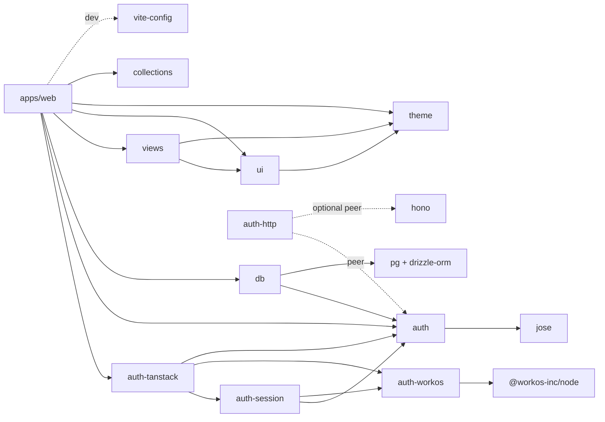
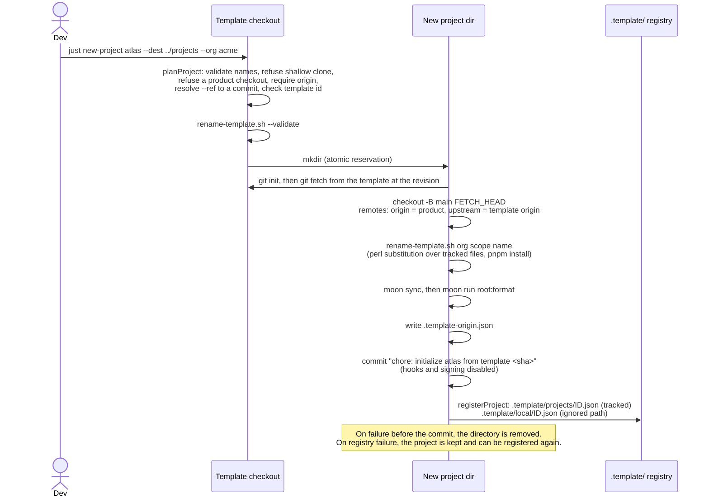
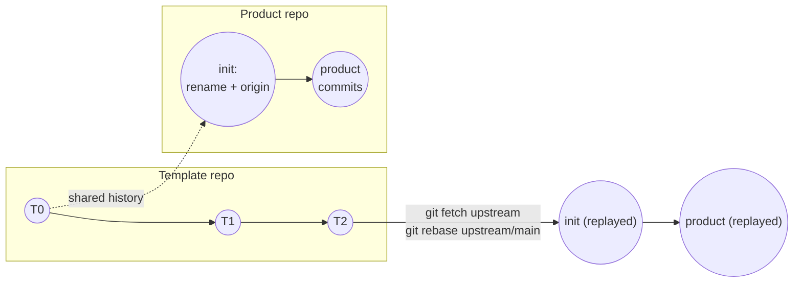
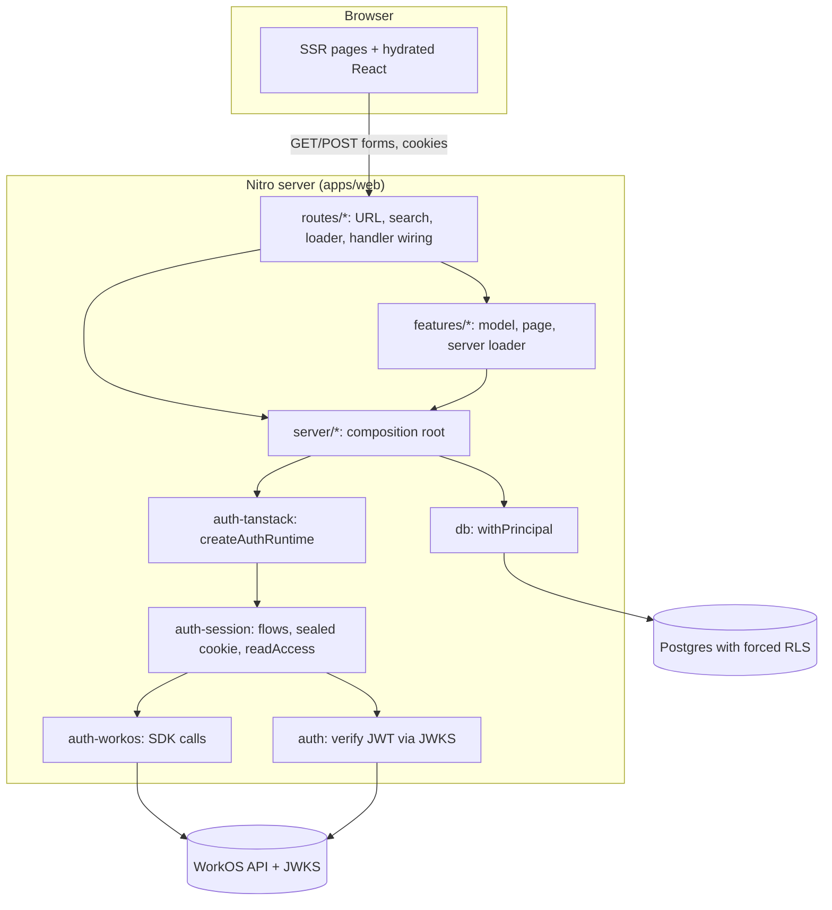
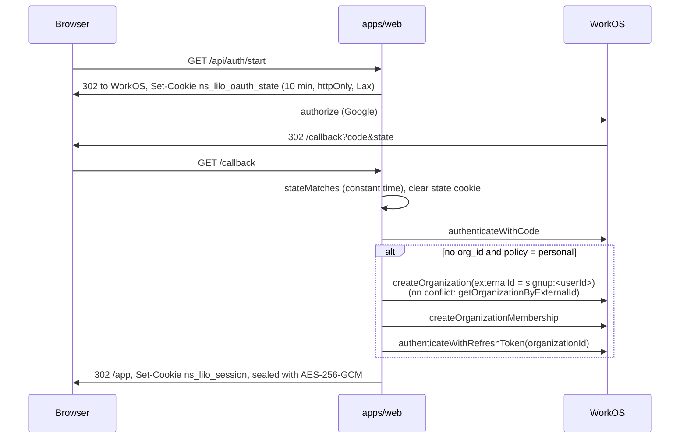
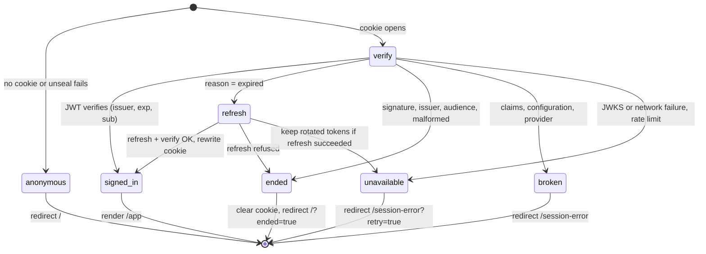
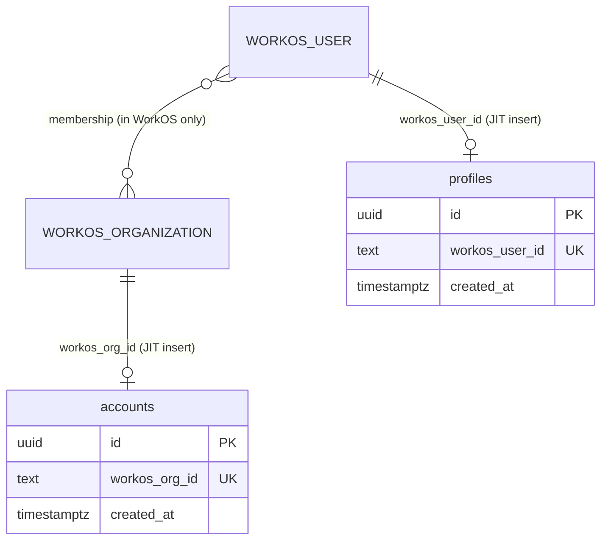
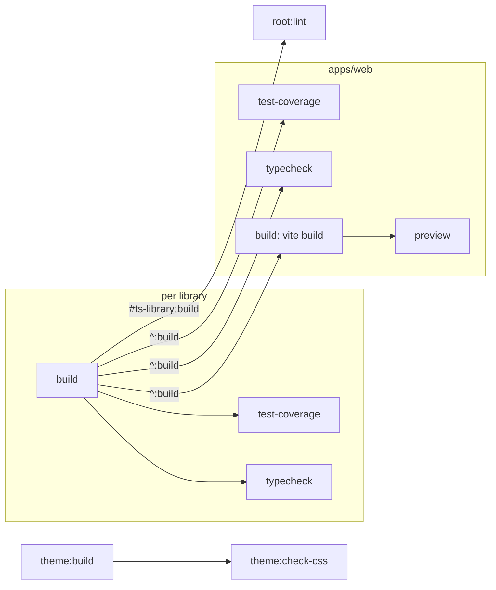

# System overview

This page maps the repository as it stands, explains how the template produces and updates product
repositories, and describes the runtime, build, test and CI design. Each claim names the file that
implements it. Rationale lives in [the decision record](decisions.md), working rules in
[AGENTS.md](../AGENTS.md), terms in [the domain model](domain-model.md), and a critical review in
[the assessment](assessment.md).

## What problem the template solves

A new product needs a monorepo that has a task graph, pinned toolchains, lint and format gates, an
identity provider, a tenant-scoped database, a component library and CI before it can do anything
useful. This repository supplies that baseline as a working application, not as generator
templates. A product starts as a Git descendant of this repository at a chosen commit. It then
receives later baseline fixes through `git fetch upstream` and `git rebase upstream/main`.

The baseline makes these choices, recorded in `docs/decisions.md`:

| Concern         | Choice                                                      | Where                                                      |
| --------------- | ----------------------------------------------------------- | ---------------------------------------------------------- |
| Task graph      | Moon 2.5.1 for every language                               | `.moon/workspace.yml`, `.moon/tasks/*.yml`, `moon.yml`     |
| JS packages     | pnpm 11 with catalogs and supply-chain policy               | `pnpm-workspace.yaml`                                      |
| Languages       | TypeScript 7 (`tsgo`), Rust 1.95                            | `pnpm-workspace.yaml` catalog, `.moon/toolchains.yml`      |
| Lint and format | oxlint (type aware) and oxfmt                               | `.oxlintrc.json`, `.oxfmtrc.json`, `moon.yml` `tasks.lint` |
| Web framework   | TanStack Start on Vite 8 and Nitro                          | `apps/web/vite.config.ts`                                  |
| Identity        | WorkOS AuthKit: Google OAuth and email codes                | `packages/auth-workos`, `packages/auth-session`            |
| Persistence     | Postgres, Atlas SQL migrations, Drizzle client, forced RLS  | `db/`, `packages/db`, `scripts/rls-verify.mjs`             |
| UI              | React 19, Tailwind 4, shadcn/Radix components, typed themes | `packages/ui`, `packages/views`, `packages/theme`          |
| Delivery        | GitHub Actions running `moon ci`, Changesets, Renovate      | `.github/workflows/`, `.changeset/`, `renovate.json`       |
| Lineage         | Shared Git history plus a consumer registry in the template | `scripts/projects.mjs`, `scripts/lib/`, `.template/`       |

## Repository map

```text
.
├── apps/web/               Reference TanStack Start application (the only app)
├── packages/
│   ├── auth/               Token verification and the Principal: jose only, no vendor SDK
│   ├── auth-workos/        WorkOS SDK wrapper, error translation, organization provisioning
│   ├── auth-session/       Framework-free HTTP sign-in flows, sealed session cookie, access states
│   ├── auth-tanstack/      TanStack Start adapter: cookie jar, lazy runtime, POST-only handlers
│   ├── auth-http/          Service bearer auth on Request/Response, Hono adapter, service config
│   ├── db/                 Pooled Postgres and the one principal-scoped transaction
│   ├── theme/              Token contract, two themes, validation, generated CSS, preference cookie
│   ├── ui/                 shadcn primitives plus layout and typography components
│   ├── views/              Composed reusable screens: sign-in, code entry, session error, theme lab
│   ├── vite-config/        Source-condition and client-boundary settings shared by Vite apps
│   └── collections/        Small TypeScript library example (groupBy, partition)
├── services/ping/          Rust member example (two functions, two tests)
├── db/
│   ├── schema.sql          Atlas desired state: accounts and profiles
│   ├── migrations/         Versioned SQL, including the hand-written RLS migration
│   └── drizzle/_generated/ Drizzle introspection artifact, checked but not imported
├── scripts/                Project creation, registry, database, security and gate scripts
├── .moon/                  Workspace, toolchains, and inherited task layers
├── .template/              Template identity and tracked consumer records
├── .changeset/             Pending changesets
├── .github/workflows/      ci.yml (moon ci) and release.yml (Changesets)
└── docs/                   Decisions, guides, specifications and this overview
```

Moon discovers members through `projects.globs` in `.moon/workspace.yml`. pnpm discovers the same
directories through `packages` in `pnpm-workspace.yaml`. The repository root is itself a Moon
project that owns workspace-wide tasks in `moon.yml`.

### Package dependencies

Edges come from each member's `package.json`. Moon mirrors them in `apps/web/moon.yml` `dependsOn`
and in TypeScript project references in each `tsconfig.json`.



### Key seams

Each seam is a narrow structural interface. Tests use it to exercise the security logic without a
live framework, provider or database.

| Seam                             | Declared in                                                                   | Implemented by                                    | Purpose                                                       |
| -------------------------------- | ----------------------------------------------------------------------------- | ------------------------------------------------- | ------------------------------------------------------------- |
| `Verifier` / `Principal`         | `packages/auth/src/verify.ts`, `principal.ts`                                 | `createVerifier` (jose + JWKS)                    | Vendor-neutral identity: `userId`, `orgId`, roles, and more   |
| `WorkOSClient`                   | `packages/auth-workos/src/client.ts`                                          | `@workos-inc/node` `WorkOS`                       | The exact SDK slice used; tests inject a recording client     |
| `CookieJar`                      | `packages/auth-session/src/cookies.ts`                                        | `packages/auth-tanstack/src/cookies.ts`           | Keeps session logic free of any web framework                 |
| `Access` union                   | `packages/auth-session/src/access.ts`                                         | `readAccess`                                      | Five session states the app branches on, never an exception   |
| `ScopedClient` / `ScopedRunner`  | `packages/db/src/scoped.ts`, `apps/web/src/features/workspace/server/rows.ts` | `pg` client, `Database.withPrincipal`             | The only way claims enter Postgres                            |
| `ThemeTarget`                    | `packages/theme/src/apply.ts`                                                 | `element.style`                                   | Applies data themes without DOM types                         |
| `@littleorgans/source` condition | every library `package.json` `exports`                                        | `packages/vite-config/src/index.ts`               | Dev resolves `src`, builds and Node resolve `dist`            |
| Composition root                 | `apps/web/src/server/*.ts`                                                    | `createAuthRuntime`, `getDatabase`, theme adapter | Application policy (paths, provider, org policy) in one place |

### Application layout

`docs/code-layout.md` is the authoritative layout guide. In summary:

- `apps/web/src/routes/` holds URL wiring only. `(auth)/` groups `/callback`, `/session-error` and
  `/verify-email` without adding a segment. `api/` directories add path segments.
- `apps/web/src/features/<name>/` owns a feature's model, UI and server behavior. `workspace/` is the
  complete example. `tasks/` is a single component. `auth/search.ts` holds a search validator.
- `apps/web/src/server/` is the composition root. `auth.ts` selects `GoogleOAuth`, `/app`,
  `personal` and `/verify-email`. `database.ts` builds the database lazily from `DATABASE_URL`.
  `theme.ts` adapts the theme cookie.
- `apps/web/src/routeTree.gen.ts` is generated by the TanStack Start Vite plugin during a build.

## How project generation works

`just new-project <name> --dest <parent> --org <org>` calls `moon run root:new-project`
(`justfile`, `moon.yml` `tasks.new-project`). That task runs `node scripts/projects.mjs create`,
which calls `planProject` and `createProject` in `scripts/lib/create-project.mjs`.



Details, all in `scripts/lib/create-project.mjs` unless noted:

- **Inputs.** `name`, `org` and `scope` must match `^[a-z0-9]+(?:[._-][a-z0-9]+)*$` (line 29). The
  default origin is `git@github.com:<org>/<name>.git`, and `--remote` overrides it (line 42).
  `--ref` selects any committed revision whose `.template/config.json` id matches (lines 49–59).
- **History.** The project fetches the selected commit and its ancestors from the local template
  (line 86). Uncommitted and ignored files are never copied. The project shares the template's
  commit graph, so `git merge-base` works.
- **Identity rewrite.** `scripts/rename-template.sh` substitutes three tokens in every tracked file
  except `.template-origin.json` and `.template/**`: `lilo-moon-template`, `littleorgans` and
  `lilo-moon` (lines 10–16, 131–148). The npm scope is `@littleorgans`, the org token, so
  `@littleorgans` is rewritten to `@<scope>` before the org pass. The substitution covers package
  names (`@littleorgans/*` becomes `@<scope>/*`), the `@littleorgans/source` export condition,
  repository URLs, the Changesets `changelog.repo`, pending changesets, and the lockfile. It then
  runs `pnpm install` and `--verify`, which fails if any token remains.
- **Provenance.** `.template-origin.json` records the template id, the starting revision, the
  template repository URL and the `org` and `scope` parameters (lines 106–119). Its presence marks a
  checkout as a product: `planProject` refuses to create from it (line 36), and
  `scripts/consumer-check.mjs` skips there (line 22).
- **Registry.** `registerProject` in `scripts/lib/project-registry.mjs` writes one tracked file per
  consumer to avoid concurrent-writer races (lines 63–99). It strips passwords, HTTP usernames and
  query strings from stored URLs (lines 42–61) and refuses to change a recorded birth revision (lines
  76–82). The new record is left uncommitted in the template. A maintainer commits it.
- **Listing.** `just projects [--json]` prints name, starting revision, repository and local path
  (`scripts/projects.mjs` lines 61–74).

Verified by running (see [the assessment](assessment.md#verification-log)): `just new-project` with
install and `--ref`, and `scripts/projects.mjs create --no-install`. Both produced a two-remote
repository whose `HEAD^` is the selected template commit. The generated project then passed 47 Moon
tasks.

## How template updates and drift are handled

The repository no longer contains a drift guard. `scripts/template-drift.mjs` and the
`.moon/templates/` generators were introduced in #88 and deleted in #94 (`1edabaf`). Their
replacement is plain Git: the template and every product share history.



The documented procedure is in `docs/project-lineage.md` and `docs/how-to-instantiate.md`:
`git fetch upstream`, `git rebase upstream/main`, `pnpm install`, `moon sync`, `just check`,
`just ci`. Several mechanisms support it:

| Mechanism                                | What it catches                                                                           | Where                                         |
| ---------------------------------------- | ----------------------------------------------------------------------------------------- | --------------------------------------------- |
| Shared ancestry                          | Lets Git compute a three-way merge between template and product                           | `create-project.mjs` line 86                  |
| `root:scripts-test`                      | Creation, remotes, a rebase of a token-free template fix, registry rules                  | `scripts/tests/integration/projects.test.mjs` |
| `root:consumer-check`                    | The template still produces a buildable, servable product, including from packed tarballs | `scripts/consumer-check.mjs`                  |
| `root:rename-verifier`                   | Only that the token list and file corpus are non-empty                                    | `moon.yml` lines 312–321                      |
| `just rename-verify` (manual, not in CI) | Template tokens left in a product's tracked files                                         | `moon.yml` lines 77–83                        |
| Consumer registry                        | Nothing automatically. It tells maintainers where products live so they can inspect them  | `.template/projects/`                         |

The product replays its initialization commit, which contains the whole identity rewrite, on
every rebase. Upstream changes that touch a token line conflict with it, and upstream files that add
a token are not rewritten. [The assessment](assessment.md#the-ugly) records both behaviors,
reproduced in a disposable pair of repositories.

## Runtime architecture

`apps/web` is a TanStack Start application. Vite builds it with `tailwindcss()`, `tanstackStart()`,
`react()` and `nitro()` (`apps/web/vite.config.ts`), and Nitro serves it from
`.output/server/index.mjs`. All authentication runs on the server. The browser only follows
redirects and submits forms.



### Routes

| URL                      | File                              | Behavior                                                               |
| ------------------------ | --------------------------------- | ---------------------------------------------------------------------- |
| `/`                      | `routes/index.tsx`                | `SignInPanel`; `?ended=true` shows the session-ended notice            |
| `/app`                   | `routes/app.tsx`                  | Server function `loadWorkspaceOrRedirect`, renders `WorkspacePage`     |
| `/theme`                 | `routes/theme.tsx`                | `ThemeLab` using the root loader's preference                          |
| `/callback`              | `routes/(auth)/callback.ts`       | `GET` → `auth.completeSignIn`                                          |
| `/verify-email`          | `routes/(auth)/verify-email.tsx`  | `VerifyCodePanel`; `?retry=true` after a refused code                  |
| `/session-error`         | `routes/(auth)/session-error.tsx` | `SessionErrorPanel`; retry link only for `unavailable`                 |
| `/api/auth/start`        | `routes/api/auth/start.ts`        | `GET` → mint state cookie, 302 to WorkOS                               |
| `/api/auth/email/start`  | `routes/api/auth/email/start.ts`  | `POST` → throttle, send code, set email cookie, 302 to `/verify-email` |
| `/api/auth/email/verify` | `routes/api/auth/email/verify.ts` | `POST` → throttle, verify code, provision org, set session             |
| `/api/auth/signout`      | `routes/api/auth/signout.ts`      | `POST` → clear cookies, 303 to WorkOS logout                           |
| `/api/theme`             | `routes/api/theme.ts`             | `POST` → update theme cookie, 303 to same-origin referer               |

`postHandlers` in `packages/auth-tanstack/src/routes.ts` answers `GET` with 405 on the POST-only
routes. Every POST route answers 403 unless its `Origin` header equals the origin of
`WORKOS_REDIRECT_URI`, and a missing `Origin` is refused too (`refuseCrossOrigin` in
`packages/auth-session/src/origin.ts`; the theme route reaches it through `auth.origin()`). The
root route (`routes/__root.tsx`) reads the theme cookie in a server function. It stamps `data-mode`
and `data-theme` on `<html>` so the first paint uses the chosen theme.

### Sign-in flows



The email-code path (`packages/auth-session/src/email.ts`) posts the address and sends a code. It
stores the address in a 10-minute httpOnly cookie, posts the code, then runs the same
`ensureOrganization` and `establishSession` steps as the callback (`callback.ts` lines 44–86).

An address over 254 characters, in the form or in the email cookie, is refused with 400 first.
Before either step calls WorkOS it asks the application's `throttle` about two keys: the client and
the lower-cased address. On verify the address key bounds guesses at one code. A refusal is a 429
with `Retry-After`. `createAuthRuntime` requires a throttle and the package ships none. The
reference `apps/web/src/server/throttle.ts` counts in process memory, keyed by the socket address,
which is right for one instance only: a deployment with more than one instance needs a throttle over
a shared store. Behind a proxy the socket address is the proxy's, so every visitor shares one budget
and is refused with everyone else once it is spent; `apps/web/src/server/auth.ts` then reads the
forwarded address with `getRequestIP({ xForwardedFor: true })`, which is safe only when the proxy
overwrites that header.

Cookie names are namespaced by `sha256(clientId:redirectUri)` (`auth-session/src/config.ts` lines
96–99, `auth-tanstack/src/runtime.ts` line 88). The session key comes from
`WORKOS_COOKIE_PASSWORD` through HKDF-SHA256 and requires at least 32 characters (`config.ts` lines
63–70). Cookies are `Secure` only when the redirect URI is HTTPS (`config.ts` line 106).

### Access on every request

`readAccess` (`packages/auth-session/src/access.ts`) turns the session cookie into one of five
states. `loadWorkspaceOrRedirect` (`apps/web/src/features/workspace/server/load-workspace.ts`) maps
each state to a page or a redirect.



WorkOS rotates the refresh token on every use. Concurrent requests that refresh one session share a
single `refreshTokens` call, held in an in-process map keyed by the SHA-256 of the refresh token and
removed when the call settles. Each request still verifies the result and writes the cookie itself.
Without this, a request that lost the race could get `invalid_grant`, count as `ended`, and clear
the cookie the winner had just written. Separate instances share nothing. A request that arrives
after the call has settled, or on another instance, relies on WorkOS returning the same rotated pair
for 30 seconds after the old token's first use.

### Data access and row level security

`Database.withPrincipal` (`packages/db/src/database.ts`) takes one pooled client and runs
`runScoped` (`packages/db/src/scoped.ts`). That sequence is `BEGIN`, `SET LOCAL ROLE authenticated`,
`set_config('request.jwt.claims', <principal JSON>, true)`, the caller's body, then `COMMIT`, or
`ROLLBACK` on error. Policies in `packages/db/migrations/20260822081700_identity.sql` read the claims through
`app.current_user_id()` and `app.current_org_id()`. Both tables have RLS enabled and forced, and
absent claims match no row.

For any login role other than a superuser, `SET LOCAL ROLE authenticated` needs a grant of
`authenticated`. The package and all repository gates share `packages/db/migrations/`, including its Atlas
checksum. The login grant lives in `packages/db/grants/login-role.sql`. The
[`@littleorgans/db` README](../packages/db/README.md#set-up-the-database) covers applying them, the
role model, and least privilege. `root:consumer-check` applies both from the packed tarball and
connects as a fresh login role.

The workspace feature is the only database caller. `countVisibleRows` (`features/workspace/server/
rows.ts`) inserts the caller's `accounts` and `profiles` rows just in time, then counts what the
policies expose. Without `DATABASE_URL`, `getDatabase()` returns `null` and the page reports that no
transaction ran.



Schema changes follow Atlas: edit `db/schema.sql`, `moon run root:atlas-diff`, hand-write any
policy migration, `atlas migrate hash`, and `moon run root:drizzle-generate`. Details are in
`docs/how-to-instantiate.md` and `docs/user-entity.md`.

### Themes and styling

`packages/theme` defines the `COLOR_TOKENS` contract (`src/contract.ts`) and the `editor` and
`canvas` themes (`src/themes/`). `renderThemesCss` generates `css/themes.css`, and
`theme:check-css` fails when the committed file differs from the source
(`packages/theme/scripts/theme-css.mjs`). `packages/ui/src/globals.css` imports Tailwind with
`source(none)` and registers only its own directory. `packages/views/src/sources.css` and
`apps/web/src/styles.css` register theirs, so each package contributes its own utility classes. The
preference cookie is `theme_<encoded origin>` (`apps/web/src/server/theme.ts` line 52). Apps on
different localhost ports therefore keep separate preferences.

## Build pipeline

Moon owns every command. `justfile` holds aliases only. Tasks come from layered files:

| File                               | Inherited by                              | Tasks                                                                                               |
| ---------------------------------- | ----------------------------------------- | --------------------------------------------------------------------------------------------------- |
| `.moon/tasks/node.yml`             | every JavaScript project                  | `typecheck`, `test`, `test-coverage`, `test-watch`                                                  |
| `.moon/tasks/node-library.yml`     | JavaScript projects with `layer: library` | `build` (clean `dist`, emit JS, emit declarations)                                                  |
| `.moon/tasks/node-application.yml` | JavaScript applications tagged `web-app`  | `build` (`vite build`), `dev`, `preview` (both load `/.env.local`)                                  |
| `.moon/tasks/rust.yml`             | Rust projects                             | `build`, `test`, `lint` (clippy `-D warnings`)                                                      |
| `moon.yml`                         | the root project only                     | lint, format, secrets, audit, lockstep, project refs, Atlas, Drizzle, RLS, creation, consumer check |



Libraries export `dist` for Node and for production builds. During `vite` serve,
`workspaceSourceConfig` adds the `@littleorgans/source` condition so apps resolve library `src`
directly (`packages/vite-config/src/index.ts` lines 64–76). The same helper installs a Rolldown
plugin that fails a build when a server-only module reaches a client chunk (lines 42–62).
TypeScript project references are written by `moon sync` (`typescript.syncProjectReferences` in
`.moon/toolchains.yml`). `root:prune-references` removes references to deleted members.

## Testing strategy

| Layer                       | Tooling                           | Location and examples                                                                           |
| --------------------------- | --------------------------------- | ----------------------------------------------------------------------------------------------- |
| Unit                        | Vitest, shared `vitest.config.ts` | `packages/*/tests/*.test.ts`, `apps/web/tests/features/**`                                      |
| Composition and integration | Vitest under `tests/integration/` | `apps/web/tests/integration/auth-wiring.test.ts` (real SDK, no network), `routes.test.tsx`      |
| Coverage floor              | V8, per file: 80/75/80/80         | `vitest.config.ts` lines 14–23                                                                  |
| Database behavior           | Real Postgres 17 in Docker        | `root:rls-verify` (6 assertions), `root:drizzle-check`, `root:atlas-lint`                       |
| Repository scripts          | `node --test`                     | `scripts/tests/**` (26 tests: creation, rebase, registry, Moon task shape, pins)                |
| Generated consumer          | Real creation, build, HTTP probes | `root:consumer-check`: gate negative proofs, route status codes, CSS utilities, packed tarballs |
| Rust                        | `cargo test`, clippy              | `services/ping/tests/ping.rs`                                                                   |

Tests reach the security logic through the seams listed above, not through mocks of framework
internals. `consumer-check` also proves that the gates fail. It plants a type error, a failing
assertion, a floating promise and malformed formatting in the generated project, and asserts that
each gate rejects its violation (`scripts/consumer-check.mjs` lines 226–253). No test drives a real
browser or a live WorkOS environment. The `measured against the live API` comments in
`packages/auth-workos` and `packages/auth-session` record manual observations.

## CI and release

`.github/workflows/ci.yml` runs one job on `vars.CI_RUNNER || ubuntu-latest`. It checks out full
history, installs pnpm, Node 24.19.0 and the Moon toolchain from `.prototools`, then runs
`pnpm install --frozen-lockfile` and `moon ci` with `MOON_BASE` and `MOON_HEAD` set for affected
detection. Tasks marked `runInCI: "always"` run on every change. These include `consumer-check`,
`lint`, `format-check`, `secrets`, `audit`, `rls-verify` and `drizzle-check`.

`.github/workflows/release.yml` runs Changesets on pushes to `main`. It opens or updates a Version
Packages pull request, and it publishes only when `vars.NPM_PUBLISH_ENABLED == 'true'`. The publish
command, `pnpm changeset:publish`, builds and publishes but does not rerun tests. It relies on
protected-branch CI, as `docs/decisions.md` explains.

Local hooks in `lefthook.yml` run `format-check`, `lint` and `secrets` on staged files, plus
commitlint. The root `prepare` script installs them through `scripts/install-hooks.mjs`, which runs
`lefthook install` only when the package is the root of a main checkout. Linked worktrees share its
`.git/hooks`, and lefthook writes the installing checkout's path into each hook. A copy of the
package below another repository's root is skipped, because lefthook would install into that
repository and create a default `lefthook.yml` there. Renovate (`renovate.json`) groups the
TypeScript and tsgolint pins and the three Moon pins. `root:tsgolint-lockstep` and
`scripts/tests/versions.test.mjs` enforce agreement between those pins.

Supply-chain policy in `pnpm-workspace.yaml` covers several risks. Dependency lifecycle scripts are
blocked unless allowed. Exotic transitive sources are blocked, and new versions wait 24 hours.
Install fails when a version's publish trust is weaker than earlier releases. `pnpm audit` fails
on high advisories unless an ignore entry carries a reason and an expiry that
`scripts/check-security.mjs` validates.
